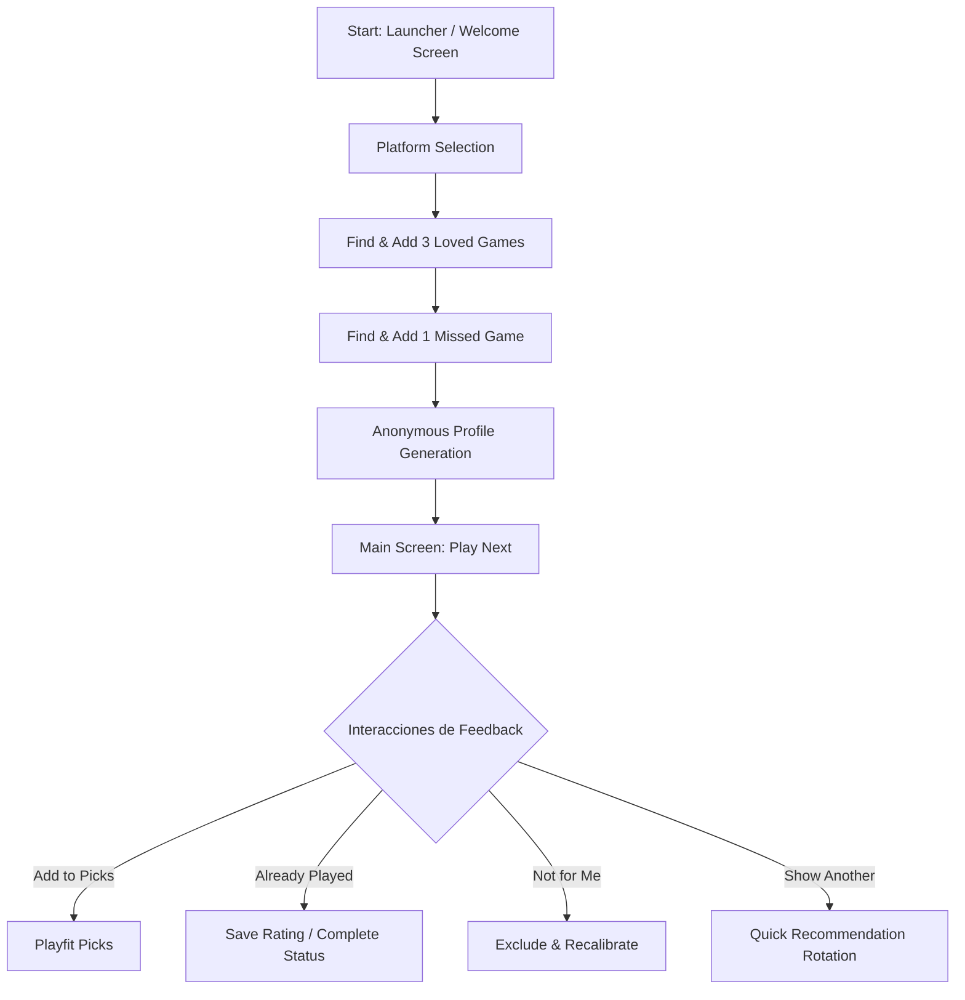

# Playfit iOS — First-Time Experience & Calibration Flow

This document describes the user experience when entering Playfit for the first time through the product flow. The primary goal is not to build a complete game library or catalog, but to answer one question as precisely as possible: **What should I play next?**

## 1. Flow Philosophy
The first-contact flow should be fast, frictionless (no sign-in required), and structured around progressive calibration.

### Onboarding Contract
1. Select available platforms.
2. Select three games the user loved (positive anchors).
3. Select one game the user did not enjoy or that "missed" (negative anchor).
4. Generate and present the first recommendation ("Play Next").

---

## 2. Diagrama de Flujo (Onboarding & Loop)

---

## 3. Calibration Step by Step

### Step A: Welcome Screen (Launcher / Welcome)
* **Goal:** Communicate the product value proposition immediately.
* **Key message:** *"Select your platforms, three games you loved, and one game that missed. Get your next game recommendation."*
* **iOS implementation:**
  * An elegant welcome card centered on screen using the native visual language (translucent background).
  * A prominent primary button ("Start Calibration") with gentle haptic feedback.
  * Authentication is not required at this step. A locally persisted `device_id` is associated internally (through `UserDefaults` or the secure keychain when persistence requires it).

### Step B: Platform Filter (Platforms)
* **Goal:** Filter the game catalog by the user's available hardware.
* **Interface:** Interactive chips for selecting consoles/systems (PC, PlayStation, Xbox, Nintendo Switch, etc.).
* **Rule:** The user must select at least one platform to unlock the next step.

### Step C: Positive Anchors (3 Loved Games)
* **Goal:** Establish the foundation of the user's taste.
* **Interface:** Native text search with real-time autocomplete backed by the game catalog.
* **Behavior:**
  * The user finds and adds exactly three games.
  * Each selection appears in a vertical or horizontal card list with cover art and an `X` button to remove or replace it.
  * They are recorded in the database as strong positive signals (`rating: 5`).

### Step D: Negative Anchor (1 Missed Game)
* **Goal:** Understand which genres, pacing, mechanics, or elements to avoid.
* **Interface:** The same search experience as Step C, focused on "a game you did not enjoy or that missed."
* **Behavior:**
  * The user finds and adds exactly one game.
  * It is recorded internally as a strong negative signal (`rating: 2`, `excluded: true`).

---

## 4. Main Screen: Decision Surface (`/`)
Once initial calibration is complete, the app stores the device profile and opens directly to this interface in later sessions.

### A. Primary Recommendation ("Play this next")
* **Presentation:** Large, prominent hero card in the upper half of the screen.
* **Elementos Visuales Clave:**
  * **Game cover art:** Centered and high quality.
  * **Confidence Score (Affinity):** Prominent percentage in a corner (for example, *85% match*), using the semantic data color (`--ink`).
  * **Human-readable reasons (Dossier):** Short text explaining why the match makes sense (for example, *"Ideal if you enjoyed X's exploration but want Y's action"*).
  * **Watch-outs:** Risks based on the game the user disliked (for example, *"Requires heavy inventory management, similar to Z"*), using the semantic `--negative` color.

### B. Secondary Alternatives ("Worth checking")
* **Presentation:** Two or three smaller cards arranged horizontally below the primary card to offer alternatives without distracting from the main focus.

### C. Quick Actions (Feedback Loop)
These actions let the user make quick decisions that recalibrate their profile in real time:
* **Add to Playfit Picks:** Saves the game to the user's priority list for later. Sets `inPlayfitPicks: true`.
* **Started:** The user indicates they started playing it. Sets `status: "playing"` and removes the game from Picks.
* **Already Played:** Opens a modal where the user selects their historical satisfaction level:
  * *Loved it!* (rating 5, completed)
  * *Liked it* (rating 4, completed)
  * *Mixed* (rating 3, completed)
  * *Dropped it* (rating 2, abandoned, excluded)
* **Not for Me:** Permanently excludes the game from future recommendations (`rating: 2`, `excluded: true`).
* **Show Another:** Replaces the current primary game with another backend recommendation without affecting or training the algorithm (a local skip with no affinity impact).
