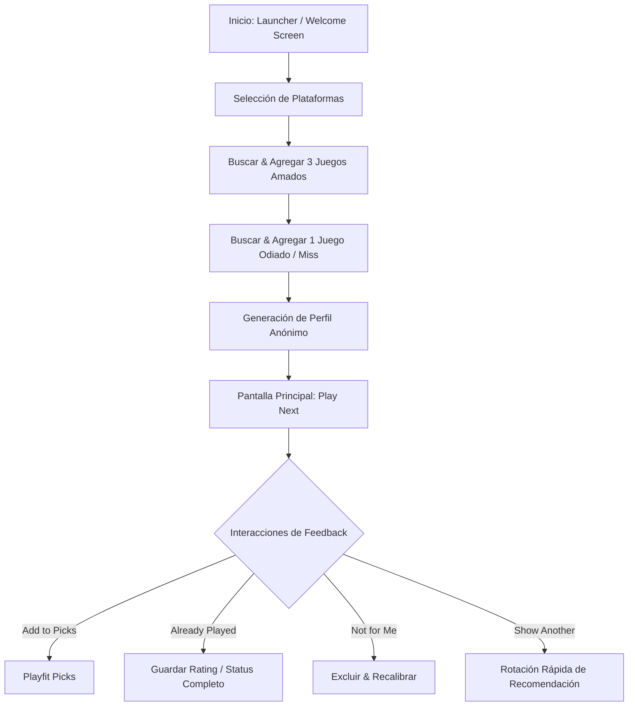

# Playfit iOS — First-Time Experience & Calibration Flow

Este documento detalla la experiencia del usuario cuando ingresa a Playfit por primera vez a través del flujo de `/play`. El objetivo principal de este flujo no es construir una biblioteca o catálogo de juegos completa, sino responder con la mayor precisión posible a la pregunta: **¿A qué debería jugar a continuación?**

## 1. Filosofía del Flujo
El flujo de primer contacto debe ser rápido, sin fricción (no requiere inicio de sesión) y estructurado bajo el principio de calibración progresiva.

### El Contrato de Onboarding:
1. Selección de plataformas disponibles.
2. Selección de 3 juegos que al usuario le encantaron (Anclas Positivas).
3. Selección de 1 juego que no le gustó o "falló" (Ancla Negativa).
4. Generación y presentación de la primera recomendación ("Play Next").

---

## 2. Diagrama de Flujo (Onboarding & Loop)

---

## 3. Detalle Paso a Paso de la Calibración

### Paso A: Pantalla de Bienvenida (Launcher / Welcome)
* **Objetivo:** Comunicar la promesa de valor de `/play` inmediatamente.
* **Mensaje Clave:** *"Elige tus plataformas, 3 juegos que amaste y 1 que no funcionó. Obtén tu siguiente juego recomendado."*
* **Implementación iOS:**
  * Una tarjeta de bienvenida elegante en el centro de la pantalla utilizando la estética nativa (translucidez del fondo).
  * Un botón primario prominente ("Comenzar Calibración") con respuesta háptica suave al tacto.
  * No se requiere autenticación en este paso. Se asocia un `device_id` local persistido de forma interna (vía `UserDefaults` o llavero seguro si se requiere permanencia).

### Paso B: Filtro de Plataformas (Platforms)
* **Objetivo:** Filtrar el catálogo de juegos por disponibilidad física del usuario.
* **Interfaz:** Rejilla interactiva de chips para seleccionar consolas/sistemas (PC, PlayStation, Xbox, Nintendo Switch, etc.).
* **Regla:** El usuario debe elegir al menos una plataforma para desbloquear el siguiente paso.

### Paso C: Anclas Positivas (3 Loved Games)
* **Objetivo:** Establecer la base de los gustos del usuario.
* **Interfaz:** Campo de búsqueda de texto nativo con autocompletado en tiempo real consumiendo el catálogo de juegos.
* **Comportamiento:**
  * El usuario busca y agrega exactamente 3 juegos.
  * Cada selección se despliega en una lista vertical u horizontal en forma de tarjetas con el arte de portada (Cover Art) y un botón `X` para borrar/remplazar.
  * Se registran en la base de datos como señales positivas fuertes (`rating: 5`).

### Paso D: Ancla Negativa (1 Miss Game)
* **Objetivo:** Entender qué géneros, ritmos de juego, mecánicas o elementos evitar.
* **Interfaz:** Misma experiencia de búsqueda que el paso C, pero enfocada en "un juego que no te haya gustado o haya fallado".
* **Comportamiento:**
  * El usuario busca y agrega exactamente 1 juego.
  * Se registra internamente como una señal negativa fuerte (`rating: 2`, `excluded: true`).

---

## 4. Pantalla Principal: Decision Surface (`/play`)
Una vez completada la calibración inicial, la app almacena el perfil del dispositivo y abre directamente en esta interfaz en las siguientes sesiones.

### A. La Recomendación Principal ("Play this next")
* **Presentación:** Tarjeta principal grande e imponente (Hero Card) en la mitad superior de la pantalla.
* **Elementos Visuales Clave:**
  * **Arte de portada del juego:** Centrado y de alta calidad.
  * **Confidence Score (Afinidad):** Porcentaje numérico destacado en una esquina (ej: *85% match*), utilizando el color semántico de datos (`--ink`).
  * **Razones Humanas (Dossier):** Extracto textual corto que explica de forma lógica el por qué del match (ej: *"Ideal si disfrutaste la exploración de X pero buscas la acción de Y"*).
  * **Watch-outs (Advertencias):** Riesgos basados en el juego que no le gustó (ej: *"Requiere administración pesada de inventario, similar a Z"*), usando el color semántico `--negative`.

### B. Alternativas Secundarias ("Worth checking")
* **Presentación:** 2 o 3 tarjetas de menor tamaño dispuestas horizontalmente debajo de la tarjeta principal para ofrecer alternativas sin distraer del foco principal.

### C. Acciones Rápidas (Feedback Loop)
Estas acciones permiten al usuario tomar decisiones rápidas que recalibran su perfil en tiempo real:
* **Add to Playfit Picks:** Guarda el juego en su lista de prioritarios para jugar más tarde. Setea `inPlayfitPicks: true`.
* **Started:** El usuario indica que empezó a jugarlo. Setea `status: "playing"` y quita el juego de los picks.
* **Already Played:** Abre un panel modal donde el usuario selecciona su nivel de satisfacción histórica:
  * *Loved it!* (rating 5, completed)
  * *Liked it* (rating 4, completed)
  * *Mixed* (rating 3, completed)
  * *Dropped it* (rating 2, abandoned, excluded)
* **Not for Me:** Excluye el juego de manera permanente de futuras recomendaciones (`rating: 2`, `excluded: true`).
* **Show Another:** Rota el juego principal actual por otra alternativa recomendada del backend sin generar impacto ni entrenar el algoritmo (es un skip local sin repercusión en la afinidad).
